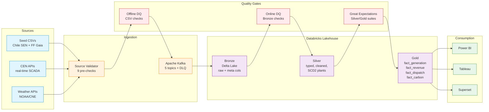
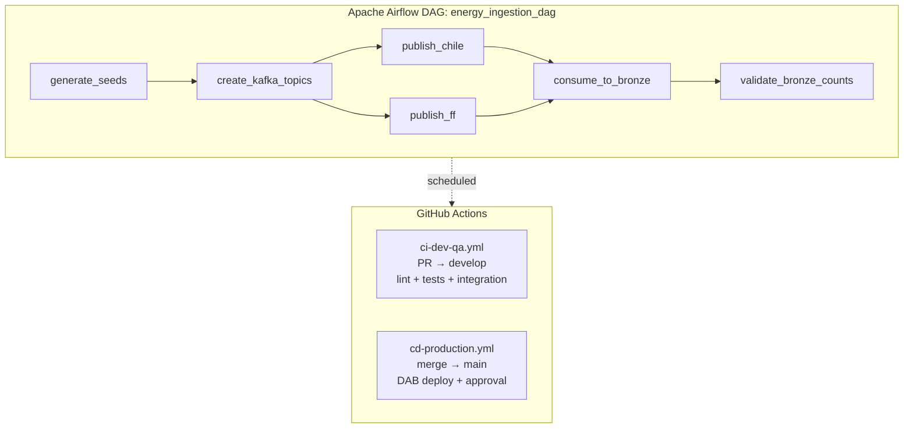

<!-- markdownlint-disable MD033 MD041 -->
<div align="center">

# POC: Renewable Energy Data Platform

**End-to-end Data Engineering Proof of Concept for Renewable Energy Grid Telemetry**

[](https://www.python.org/downloads/)
[](https://docs.astral.sh/uv/)
[](https://docs.astral.sh/ruff/)
[](https://docs.pytest.org/)
[](https://www.conventionalcommits.org)
[](#license)
[](docs/poc-agile-plan-energy.md)

[Quick start](#-quick-start) ·
[Architecture](#%EF%B8%8F-architecture) ·
[Data model](#-data-model) ·
[Development](#-development-workflow) ·
[Roadmap](#-roadmap) ·
[Docs](#-documentation)

</div>

---

## 📑 Table of contents

- [Overview](#-overview)
- [Architecture](#%EF%B8%8F-architecture)
- [Tech stack](#-tech-stack)
- [Quick start](#-quick-start)
- [Project structure](#-project-structure)
- [Data model](#-data-model)
- [Data sources](#-data-sources)
- [Environments](#-environments)
- [Development workflow](#-development-workflow)
- [Testing strategy](#-testing-strategy)
- [Deployment](#-deployment)
- [Cost model](#-cost-model)
- [Observability & SLA](#-observability--sla)
- [Roadmap](#-roadmap)
- [Documentation](#-documentation)
- [Contributing](#-contributing)
- [Team](#-team)
- [References](#-references)
- [License](#license)

---

## 🌍 Overview

Production-grade data engineering Proof of Concept that ingests, validates, transforms, and serves renewable-energy grid telemetry across the **Bronze → Silver → Gold** medallion architecture on **Databricks Delta Lake**, orchestrated by **Apache Airflow**, with full **CI/CD via GitHub Actions** and **Databricks Asset Bundles**.

**Industrial context**: Provisión de electricidad desde fuentes de energía renovables — modeling generation (solar, wind, hydro, geothermal, tidal), demand, weather, dispatch, and revenue across 12 Chilean SEN nodes (real CEN data references) and 12 Final Fantasy Gaia nodes (fictional, mapped from Chile with realistic divergence — used to validate multi-region pipeline patterns without exposing sensitive operational data).

**Why this POC matters**

- ✅ Validates the **Airflow + Databricks + GitHub Actions** stack end-to-end on a non-trivial domain
- ✅ Demonstrates **medallion architecture** with realistic SLA/DQ gates per layer
- ✅ Establishes **production-grade engineering hygiene** (uv, ruff, pytest, pre-commit, conventional commits, sqlfluff)
- ✅ Delivers a **pay-as-you-go cost model** ($400–$1,000/month) with explicit traceability to compute drivers
- ✅ Provides **reusable patterns** for future production data platforms (idempotency, lineage, env separation, DLQ)

**Scope:** 10-week timeline · 5 sprints · 3 Data Engineers + 1 PM · for **Evalueserve**.

---

## 🏗️ Architecture

### High-level data flow



### Orchestration



### Medallion layers

| Layer | Catalog | Purpose | Materialization |
|---|---|---|---|
| **Bronze** | `energy_catalog.bronze.*` | Raw landing from Kafka, no transformation | Delta Lake, partitioned by `(node_id, DATE(timestamp))` |
| **Silver** *(TODO Sprint 2-3)* | `energy_catalog.silver.*` | Typed, cleaned, deduped, weather-generation joins, SCD2 plants | Delta Lake, optimized + Z-ORDERed |
| **Gold** *(TODO Sprint 3)* | `energy_catalog.gold.*` | Business-ready facts and dimensions | Delta Lake, materialized for BI sub-5s queries |

---

## 🛠️ Tech stack

| Layer | Tool | Version | Role |
|---|---|---|---|
| **Language** | Python | 3.12+ | Pipeline code, DAGs, transforms |
| **Dependency mgmt** | [uv](https://docs.astral.sh/uv/) | latest | venv + lockfile |
| **Streaming** | Apache Kafka | 7.7 | Decouple sources from Bronze, enable replay + DLQ |
| **Lakehouse** | Databricks Delta Lake | Photon engine | ACID, time travel, schema evolution |
| **Orchestration** | Apache Airflow | 2.10+ | Workflow DAG, retries, SLA alerts |
| **Transformation** | dbt-core + dbt-databricks | 1.9+ | SQL modeling, lineage, tests |
| **Data quality** | Great Expectations | 1.3+ | Schema, value, distribution suites |
| **Governance** | Databricks Unity Catalog | — | RBAC, lineage, column-level access |
| **CI/CD** | GitHub Actions | — | PR validation + DAB deploy |
| **Deployment** | Databricks Asset Bundles | — | Infrastructure-as-code for Databricks |
| **BI** | Power BI / Tableau / Superset | — | Dashboards (Sprint 5) |
| **Linting** | ruff | 0.8+ | Python lint + format |
| **SQL linting** | sqlfluff | 3.2+ | Databricks SQL dialect |
| **Testing** | pytest + pytest-cov | 8.0+ | Unit + integration + smoke |
| **Type checking** | mypy | 1.13+ | Static analysis |
| **Hooks** | pre-commit | 4.0+ | Format, lint, conventional commits |

---

## 🚀 Quick start

### Prerequisites

| Tool | Required version | Install |
|---|---|---|
| OS | WSL2 Ubuntu 22.04+, Linux, macOS | — |
| Python | 3.12+ | managed by `uv` |
| `uv` | latest | `curl -LsSf https://astral.sh/uv/install.sh \| sh` |
| Git | 2.30+ | `apt install git` / `brew install git` |
| Docker | optional | only for local Kafka |

### Five-minute setup

```bash
# 1. Clone
git clone https://github.com/fuad-onate-evs/poc-data-engineering-data-architecture-2026.git
cd poc-data-engineering-data-architecture-2026

# 2. Create venv + install deps (uv reads pyproject.toml + uv.lock)
uv venv --python 3.12
uv sync                       # runtime
uv sync --group dev           # dev tools (ruff, pytest, pre-commit, sqlfluff, mypy)

# 3. Install pre-commit hooks
uv run pre-commit install
uv run pre-commit install --hook-type commit-msg

# 4. Configure environment
cp .env.example .env          # edit secrets, or source envs/.env.dev

# 5. Smoke test the install
uv run pytest                 # 5 module-parse tests should pass
uv run ruff check .           # should be clean
```

### Run the pipeline locally (no Databricks needed)

```bash
# Generate 3 days of Chile + FF seed data
uv run python ingestion/generate_seeds_unified.py --mode both --days 3

# (optional) Spin up local Kafka in Docker — see docs/ONBOARDING.md §4
# Then publish + consume to local Delta files (writes Parquet under data/bronze/)
uv run python -m ingestion.producers.seed_producer --create-topics --dataset chile
uv run python -m ingestion.consumers.bronze_writer --mode local-delta --timeout 30
```

**Full walkthrough:** [docs/ONBOARDING.md](docs/ONBOARDING.md)

---

## 📁 Project structure

```text
poc-data-eng/
├── README.md                       # ← you are here
├── AGENTS.md                       # full architecture + conventions reference
├── SESSION_UPDATE.md               # last-session handoff for IDE agents
├── pyproject.toml                  # uv-managed deps + tool configs (ruff, pytest, mypy, sqlfluff)
├── uv.lock                         # locked dependency graph (committed)
├── .python-version                 # 3.12
├── .pre-commit-config.yaml         # ruff + sqlfluff + conventional-commits hooks
├── .env.example                    # canonical env template
│
├── envs/                           # per-environment overrides (gitignored secrets)
│   ├── .env.dev
│   ├── .env.qa
│   └── .env.prd
│
├── .github/workflows/              # GitHub Actions
│   ├── ci-dev-qa.yml               # PR → develop: lint, tests, (TODO) integration
│   └── cd-production.yml           # merge → main: (TODO) DAB deploy + approval
│
├── ingestion/                      # ── Bronze pipeline ──
│   ├── generate_seeds_unified.py   # Chile (real SEN) + FF (mapped + jitter) seed gen
│   ├── config/settings.py          # KafkaConfig + DatabricksConfig + AppConfig dataclasses
│   ├── producers/seed_producer.py  # CSV → Kafka topics (5 topics + DLQ)
│   ├── consumers/bronze_writer.py  # Kafka → Bronze (3 modes: local-delta, databricks-sql, spark)
│   └── schemas/bronze_ddl.sql      # Unity Catalog DDL: 5 tables + dead_letter_queue
│
├── dags/
│   └── energy_ingestion_dag.py     # Airflow DAG: generate → publish → consume → validate
│
├── transform/                      # ── dbt project (Sprint 2-3) ──
│   ├── seeds/                      # Chile CSV outputs (gitignored)
│   └── seeds_ff/                   # FF CSV outputs (gitignored)
│
├── tests/
│   └── test_smoke.py               # ast.parse smoke tests (real suite Sprint 5)
│
└── docs/
    ├── ONBOARDING.md               # team walkthrough (prereqs, setup, troubleshooting)
    ├── poc-overview.md             # canonical project brief (cost, schedule, justification)
    ├── poc-agile-plan-energy.md    # bilingual sprint plan: 6 epics, 15 stories, 148 SP
    ├── pm/                         # sprint board snapshots
    └── widgets/                    # interactive Chile + FF grid visualizations (HTML)
```

---

## 📊 Data model

### Bronze tables ([`ingestion/schemas/bronze_ddl.sql`](ingestion/schemas/bronze_ddl.sql))

| Table | Purpose | Key columns | Partition |
|---|---|---|---|
| `scada_telemetry` | SCADA generation per source type | `timestamp`, `node_id`, `solar_mw`, `wind_mw`, `hydro_mw`, `geothermal_mw`, `tidal_mw`, `total_generation_mw` | `(node_id, DATE(timestamp))` |
| `weather` | Weather observations per node | `timestamp`, `node_id`, `solar_irradiance_wm2`, `wind_speed_ms`, `temperature_c`, `humidity_pct` | `(node_id, DATE(timestamp))` |
| `demand` | Electricity demand by sector | `timestamp`, `node_id`, `demand_mw`, `residential_pct`, `industrial_pct`, `commercial_pct` | `(node_id, DATE(timestamp))` |
| `grid_dispatch` | Grid balance, pricing, carbon | `timestamp`, `node_id`, `balance_mw`, `curtailment_mw`, `spot_price`, `ppa_price`, `revenue`, `carbon_offset_tco2e` | `(node_id, DATE(timestamp))` |
| `plants` | Asset registry (SCD source) | `plant_id`, `node_id`, `source_type`, `capacity_mw`, `ppa_price_mwh`, `lat`, `lon`, `cen_barra` | none |
| `dead_letter_queue` | Failed messages for replay | `received_at`, `topic`, `partition_id`, `offset_id`, `value`, `error_message` | none |

### Meta columns (every Bronze row)

| Column | Type | Purpose |
|---|---|---|
| `_loaded_at` | TIMESTAMP | UTC when row was written to Bronze |
| `_source` | STRING | Origin Kafka topic name |
| `_batch_id` | STRING | Consumer batch UUID for traceability |
| `_kafka_partition` | INT | Source partition number |
| `_kafka_offset` | BIGINT | Source offset (idempotency key) |
| `_dataset` | STRING | `chile` or `ff` |

### Currency normalization

- **Chile**: USD
- **FF Gaia**: Gil (fictional)
- Both normalized to generic columns (`spot_price`, `revenue`, `curtailment_cost`) in Bronze. Currency context preserved via `_dataset`.

### Gold layer (Sprint 3 — TODO)

```text
fact_generation     ← MWh, capacity factor, availability per (plant, hour)
fact_revenue        ← PPA settlements, spot revenue, blended $/MWh
fact_dispatch       ← Curtailment rate, grid balance
fact_carbon         ← tCO₂e avoided vs baseline
dim_node            ← Node attributes, region, climate
dim_plant           ← SCD2 plant registry
dim_time            ← Hour, day, month, season
```

---

## 🌐 Data sources

### Chile (12 SEN nodes, Arica → Coyhaique)

Real grid references from **Coordinador Eléctrico Nacional (CEN)** and **Comisión Nacional de Energía (CNE)**:

| Source | URL | Purpose |
|---|---|---|
| CEN SCADA real-time | [coordinador.cl](https://www.coordinador.cl/operacion/graficos/operacion-real/generacion-real-horaria-scada/) | Hourly generation per plant |
| CEN Hourly History CSV | [coordinador.cl/reportes-y-estadisticas](https://www.coordinador.cl/reportes-y-estadisticas/) | "Generación Horaria por Central" |
| CEN API Portal (SIP) | [portal.api.coordinador.cl](https://portal.api.coordinador.cl/) | REST: generation, demand, marginal cost |
| CNE Energía Abierta | [energiaabierta.cl](https://energiaabierta.cl/) | Capacity, generation by region |
| CNE Dev API | [desarrolladores.energiaabierta.cl](https://desarrolladores.energiaabierta.cl/) | `/capacidad-instalada/v1/`, `/generacion-bruta/v1/` |
| RENOVA registry | [coordinador.cl/renova](https://www.coordinador.cl/renova/) | Renewable traceability |
| Generadoras Chile | [generadoras.cl](https://generadoras.cl/) | Monthly bulletin: renewable %, curtailment |

Each Chile node carries a `cen_barra` reference for joining with real CEN API data.

### Final Fantasy Gaia (12 fictional nodes)

Chile is the **source of truth**. FF nodes diverge via three independent mechanisms (validates multi-region pipeline patterns without sensitive data exposure):

1. **`source_overrides`** — independent capacity values (not scaled from Chile)
2. **`cap_jitter`** — random ±15-30% per source type (deterministic seed per city)
3. **`unique_traits`** — demand shape modifiers (Midgar night-load boost, Gold Saucer entertainment evening spike, Zanarkand arctic heating, etc.)

Mapping table: `transform/seeds_ff/chile_to_ff_mapping.csv` (generated alongside seeds).

---

## 🌎 Environments

| Aspect | dev | qa | prd |
|---|---|---|---|
| **Kafka** | localhost:9092, PLAINTEXT | SASL_SSL, shared cluster | SASL_SSL, 3+ brokers |
| **Databricks catalog** | `energy_catalog_dev` | `energy_catalog_qa` | `energy_catalog` |
| **Consumer mode** | `local-delta` (Polars → Parquet) | `databricks-sql` | `databricks-sql` |
| **DQ null %** | ≤ 5.0% | ≤ 2.0% | ≤ 0.1% |
| **DQ duplicate %** | ≤ 1.0% | ≤ 0.5% | ≤ 0.1% |
| **DQ freshness max** | 168h (7d) | 48h | 2h |
| **Fail on warn** | ❌ | ❌ | ✅ |
| **Airflow retries** | 1 | 2 | 3 |
| **Schedule** | `@once` | `@once` | `@hourly` |

Configure via `envs/.env.{dev,qa,prd}` (gitignored). See [`.env.example`](.env.example) for the canonical template.

---

## 🔧 Development workflow

### Branching

```text
main                        ← protected, auto-deploys to prd
  └── develop               ← protected, auto-deploys to qa
        └── feat/<ticket>   ← short-lived, PR to develop
        └── fix/<ticket>
        └── docs/<topic>
```

### Conventional commits (enforced via pre-commit hook)

```text
feat:     new feature
fix:      bug fix
docs:     documentation only
chore:    build, deps, tooling
refactor: code change without behavior change
test:     adding/fixing tests
ci:       CI/CD config
build:    build system
perf:     performance improvement
```

Example: `feat(ingestion): add SCD2 handling to plants Bronze writer`

### Pre-commit hooks (auto-installed)

| Hook | What it does |
|---|---|
| `ruff` | Fast Python lint + autofix |
| `ruff-format` | Python formatter (black-compatible) |
| `sqlfluff-fix` | SQL lint + autofix (Databricks dialect) |
| `conventional-pre-commit` | Validates commit message format |

Run all hooks manually: `uv run pre-commit run --all-files`

### Code conventions

- **Python 3.12+**, type hints required on public functions
- **`snake_case`** everywhere (tables, columns, modules)
- **Tables**: `seed_*` (raw) → `stg_*` (Silver staging) → `fact_*` / `dim_*` (Gold)
- **Kafka topics**: `energy.bronze.{table}` (6 partitions, snappy compression)
- **Delta tables**: `PARTITIONED BY (node_id, DATE(timestamp))`, `delta.autoOptimize.optimizeWrite = true`
- **Meta columns**: every Bronze row gets `_loaded_at`, `_source`, `_batch_id`, `_kafka_partition`, `_kafka_offset`, `_dataset`
- **Secrets**: never hardcoded — `envs/.env.{dev,qa,prd}` locally, GitHub secrets in CI

---

## 🧪 Testing strategy

The full test pyramid (Sprint 5 / US-5.1):

```text
                    ┌─────────────┐
                    │     UAT     │  ← BI users + stakeholders
                    └──────┬──────┘
                  ┌────────┴────────┐
                  │   E2E pipeline  │  ← Bronze→Silver→Gold integration
                  └────────┬────────┘
              ┌────────────┴────────────┐
              │  Data quality (GE)      │  ← Schema, ranges, distributions
              └────────────┬────────────┘
        ┌──────────────────┴──────────────────┐
        │  Integration (Kafka, Databricks)    │  ← real broker, real catalog
        └──────────────────┬──────────────────┘
   ┌────────────────────────┴────────────────────────┐
   │              Unit tests (pytest)                │  ← pure functions, transforms
   └─────────────────────────────────────────────────┘
```

**Currently in place** (this session):
- `tests/test_smoke.py` — `ast.parse` validates every pipeline module is syntactically valid (5 tests)
- `uv run ruff check .` — lint clean
- `uv run ruff format --check .` — format clean

**Coming in later sprints**:
- Unit tests for `bronze_writer` row enrichment + currency normalization (Sprint 2)
- Integration test for full Kafka → local-delta round trip in CI (Sprint 4)
- Great Expectations suites for Bronze + Silver + Gold (Sprint 5)
- Performance benchmark: Gold queries < 5s (Sprint 5)
- UAT scenarios with grid ops, trading, and compliance personas (Sprint 5)

Run locally:

```bash
uv run pytest                                  # smoke tests
uv run pytest --cov=ingestion --cov-report=term  # with coverage
uv run ruff check .                            # lint
uv run sqlfluff lint ingestion/schemas/        # SQL lint
```

---

## 🚢 Deployment

### CI (`.github/workflows/ci-dev-qa.yml`)

Triggers on PR → `develop`. Runs:

1. ✅ `uv sync --all-extras`
2. ✅ `uv run ruff check .`
3. ✅ `uv run ruff format --check .`
4. ✅ `uv run pytest tests/`
5. ⏳ Source validation (Sprint 4)
6. ⏳ Offline DQ checks (Sprint 4)
7. ⏳ Kafka integration test (Sprint 4)

### CD (`.github/workflows/cd-production.yml`)

Triggers on merge → `main`. Runs:

1. ⏳ Strict source validation (`--fail-on-warn`)
2. ⏳ Databricks Asset Bundle deploy (`databricks bundle deploy --target prd`)
3. ⏳ GitHub Environment **manual approval gate**
4. ⏳ Post-deploy smoke run + Slack notification

### Databricks Asset Bundle (Sprint 4)

`databricks.yml` will codify: catalog/schemas, jobs (ingestion + dbt run), warehouses, permissions, secret scopes — fully reproducible across dev/qa/prd via target overrides.

---

## 💰 Cost model

Pay-as-you-go OpEx, target **$400–$1,000 USD/month**:

| Item | Monthly | Driver |
|---|---|---|
| Data Migration | $100 – $200 | Lakeflow Connect / batch ingest hours |
| Data Storage | $5 – $15 (per 100 GB) | Delta Lake S3 storage |
| ETL Implementation | $100 – $400 | Small multi-node Photon cluster hours |
| Query Analytics | $100 – $200 | Serverless SQL warehouse for ad-hoc |
| BI Processing | $100 | BI tools connect free; compute above |
| **TOTAL** | **$400 – $1,000** | |

Daily monitoring of Databricks DBUs + auto-termination on idle clusters mitigates runaway cost (see [Risks](docs/poc-agile-plan-energy.md#risks--riesgos)).

---

## 📡 Observability & SLA

| Metric | Target | Where |
|---|---|---|
| Pipeline success rate | ≥ 95% | Airflow UI + alerts |
| Bronze freshness | dev: 168h · qa: 48h · prd: 2h | DQ freshness check |
| Gold query latency | < 5s | Databricks SQL warehouse |
| Test coverage | ≥ 80% on core logic | `pytest --cov` |
| Monthly cost | $400 – $1,000 | Databricks billing API |

DAG-level alerts: email + Slack on failure, SLA miss, and DLQ threshold breach (Sprint 5 / US-5.2).

---

## 🗺️ Roadmap

### ✅ Done (post-bootstrap, Sprint 1)

- [x] Project scaffold + git initialized + GitHub remote
- [x] uv-managed `pyproject.toml` (runtime + dev deps)
- [x] Tooling: ruff, pytest, mypy, sqlfluff, pre-commit, editorconfig
- [x] Env templates (dev/qa/prd) + `.env.example`
- [x] CI/CD workflow skeletons
- [x] Seed generator (Chile 12 + FF 12 nodes with realistic divergence)
- [x] Kafka producer + Bronze consumer (3 modes)
- [x] Bronze DDL (Unity Catalog, 5 tables + DLQ)
- [x] Settings module (KafkaConfig + DatabricksConfig + AppConfig)
- [x] Airflow DAG (single-env baseline)
- [x] README + ONBOARDING + POC overview docs
- [x] Smoke test suite (5 ast-parse tests, all green)

### 🔄 In progress (Sprint 1-2)

- [ ] Make `energy_ingestion_dag.py` env-aware (currently hardcoded `databricks-sql` + `kafka:9092`)
- [ ] Source validator (`ingestion/validators/source_validator.py`) — 9 pre-ingestion checks
- [ ] Bronze DQ checks (`ingestion/dq/bronze_checks.py`) — offline + online modes

### 📋 Backlog (Sprint 2-5)

- [ ] dbt project: `dbt-databricks` adapter, `profiles.yml`, Silver staging models, Gold marts
- [ ] Databricks Asset Bundle (`databricks.yml`)
- [ ] Great Expectations suites for Silver + Gold
- [ ] CI/CD: source validation, integration test, DAB deploy with approval gate
- [ ] Real test suite (unit + integration + E2E)
- [ ] Power BI / Tableau / Superset dashboards
- [ ] OpenMetadata / Unity Catalog tagging + lineage
- [ ] UAT cases for grid ops / trading / compliance personas
- [ ] Cost tracking dashboard + alerts

Full sprint breakdown: [docs/poc-agile-plan-energy.md](docs/poc-agile-plan-energy.md)

---

## 📚 Documentation

| Doc | Purpose |
|---|---|
| [AGENTS.md](AGENTS.md) | Full architecture, conventions, current Done/TODO — also project context for LLM tooling |
| [docs/ONBOARDING.md](docs/ONBOARDING.md) | First-day team walkthrough (prereqs, setup, troubleshooting) |
| [docs/poc-overview.md](docs/poc-overview.md) | Original POC brief (cost, schedule, justification) |
| [docs/poc-agile-plan-energy.md](docs/poc-agile-plan-energy.md) | Bilingual sprint plan: 5 sprints, 6 epics, 15 stories, 148 SP |
| [docs/widgets/](docs/widgets/) | Interactive Chile + FF grid simulations (HTML) |
| [SESSION_UPDATE.md](SESSION_UPDATE.md) | Last-session handoff for IDE agents |

---

## 🤝 Contributing

This is a closed POC for Evalueserve. Internal team workflow:

1. Create a feature branch from `develop`: `git checkout -b feat/<ticket>`
2. Make your changes, run `uv run pre-commit run --all-files` locally
3. Commit using conventional format (the hook will reject malformed messages)
4. Push and open a PR to `develop`
5. CI must be green (lint + tests + format)
6. Get **at least 1 review** from another DE
7. Squash-merge into `develop` (auto-deploys to qa)
8. After QA validation, PM opens release PR `develop → main` (auto-deploys to prd with approval gate)

**Definition of Done** (per [docs/poc-agile-plan-energy.md](docs/poc-agile-plan-energy.md#dod--definition-of-done)):

- [ ] PR reviewed + approved (≥ 1 reviewer)
- [ ] CI green (lint + tests)
- [ ] Docs updated
- [ ] Deployed to staging
- [ ] Data quality checks pass

---

## 👥 Team

| Role | Focus |
|---|---|
| **DE1 (Lead)** | Architecture, CI/CD, data modeling, dbt |
| **DE2** | Ingestion, Bronze + Silver pipelines, Kafka |
| **DE3** | Transformation, Gold layer, testing |
| **PM** | Planning, stakeholders, UAT, cost tracking |

---

## 🔗 References

### Stack documentation

- [Databricks Delta Lake](https://docs.databricks.com/en/delta/index.html)
- [Databricks Asset Bundles](https://docs.databricks.com/en/dev-tools/bundles/index.html)
- [Apache Airflow](https://airflow.apache.org/docs/)
- [Apache Kafka](https://kafka.apache.org/documentation/)
- [dbt Databricks adapter](https://docs.getdbt.com/docs/core/connect-data-platform/databricks-setup)
- [Great Expectations](https://docs.greatexpectations.io/)
- [Unity Catalog](https://docs.databricks.com/en/data-governance/unity-catalog/index.html)
- [Lakeflow Connect](https://docs.databricks.com/en/ingestion/lakeflow-connect/index.html)
- [uv](https://docs.astral.sh/uv/)
- [ruff](https://docs.astral.sh/ruff/)

### Chilean energy data

- [Coordinador Eléctrico Nacional (CEN)](https://www.coordinador.cl/)
- [CEN API Portal](https://portal.api.coordinador.cl/)
- [Comisión Nacional de Energía — Energía Abierta](https://energiaabierta.cl/)
- [Generadoras de Chile](https://generadoras.cl/)

### Methodology

- [Medallion Architecture (Databricks)](https://www.databricks.com/glossary/medallion-architecture)
- [Conventional Commits](https://www.conventionalcommits.org/)
- [Test Pyramid (Martin Fowler)](https://martinfowler.com/articles/practical-test-pyramid.html)

---

## License

Proprietary — © 2026 Evalueserve POC. All rights reserved.

---

<div align="center">

**Built with ❤️ by the Data Engineering team**
*Renewable energy data, grid telemetry, and a 10-week deadline.*

</div>
